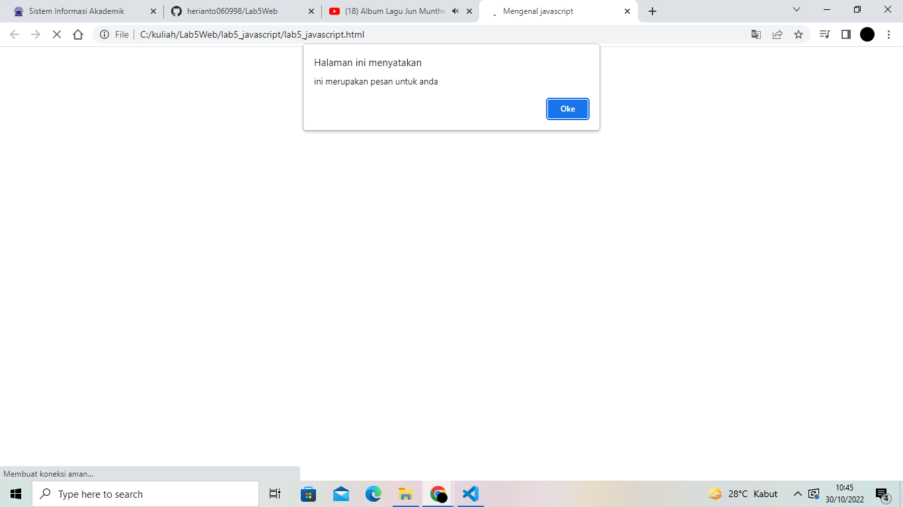

# Lab5Web

# TUGAS 5

| Nama | kelas | Nim | Matkul |
| -- | --- | ---- | ----------- |
| Heri Anto Simamora | TI.21.B.2| 312110365 | Perograman Web |

## LANGKAH-LANGKAH PRAKTIKUM

## JAVASCRIPT DASAR 

### PEMAKAIAN ALERT SEBAGAI PROPERTY WINDOW

### PEMAKAIAN METHOD DALAM OBJEK

### PEMAKAIAN PROMPT

### PEMBUATAN FUNGSI DAN CARA PEMANGGILANNYA

## DASAR PEMROGRAMAN DI JAVASCRIPT
### OPERASI DASAR ARITMATIKA

### SELEKSI KONDISI (IF.ELSE)

LULUS 

TIDAK LULUS 

### PENGGUNAAN OPERATOR SWITCH UNTUK SELEKSI KONDISI

BILANGAN 1 

BILANGAN 2 

BILANGAN 3 

BILANGAN 4 

BILANGAN 5 

BILANGAN LAIN

## PEMBUATAN FORM

### FORM INPUT 

### FORM BUTTON

## HTML DOM

